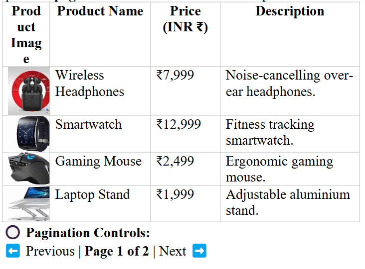
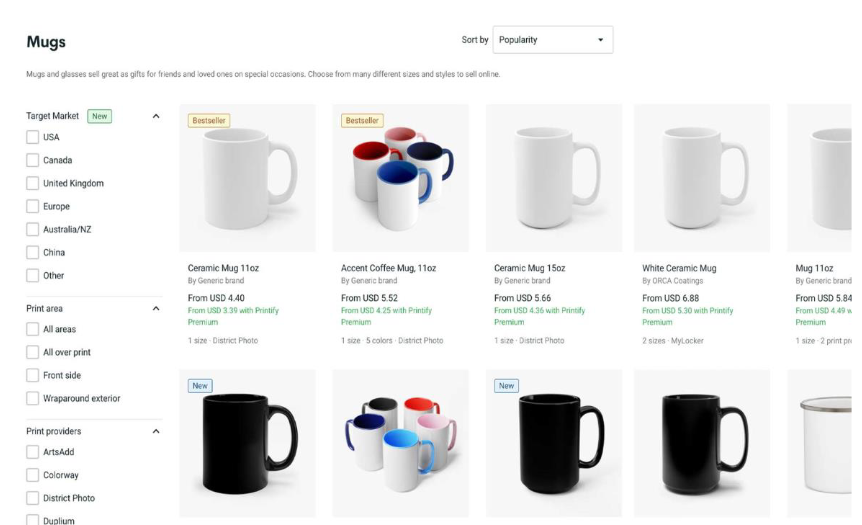
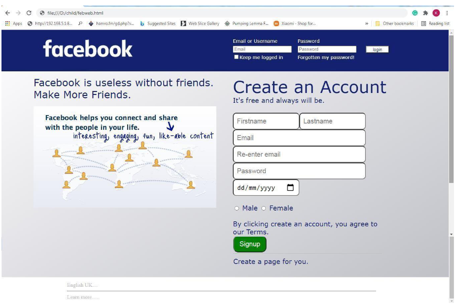
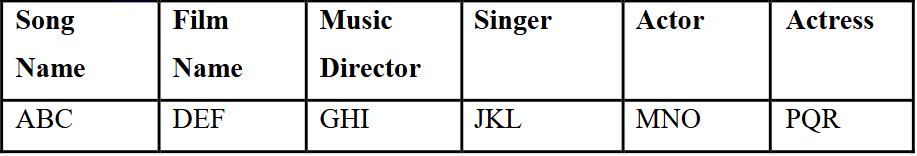
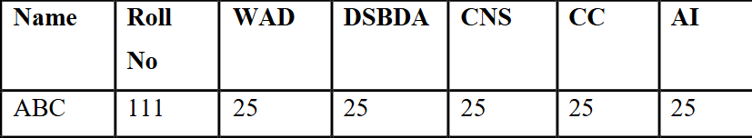

## HTML
1. Develop a responsive product catalog webpage using HTML, CSS, and JavaScript. The webpage should display products in a table format with images and implement pagination if there are more than 10 products.

2. Create a personal portfolio webpage using HTML and CSS. The webpage should showcase personal details, skills, projects, educational details, and contact information.
3. Design a restaurant menu webpage using HTML and CSS, including menu categories, dishes, and pricing. 
Content 
"ABC  Delights - Restaurant Menu" 
Welcome to ABC Delights 
Restaurant introduction, chef’s message, and food quality assurance. 
Top dishes ranked based on popularity (e.g., 1. Paneer Tikka, 2. Biryani) 
Available cuisines (e.g., - Italian, - Indian, - Chinese) 
Menu table with Dish Name, Description, Price (INR ₹) 
Add suitable images for the Dish
4. Develop a webpage for an online course listing using HTML and CSS, showcasing available courses and their details. 
Content 
"Online Learning Hub - Courses" 
Welcome to Online Learning Hub 
Introduction to online learning, benefits, and course offerings. 
Step-by-step learning paths (e.g., 1. Beginner, 2. Intermediate, 3. 
Advanced) 
Course categories (e.g., - AI & ML, - Data Science, - Web 
Development) 
Course table with Course Name, Instructor, Duration, Fee (INR ₹)
## Bootstrap
5. Create an e-commerce product listing page using Bootstrap. The page should feature a grid layout with Bootstrap cards for product display and implement category filters using Bootstrap's dropdown. The page should be fully responsive for different screen sizes.

6. Create a responsive web page for College website with top navbar and display toppers data statistics (year wise) in card using Bootstrap 
Section Content 
Title "Pune Institute of Computer Technology" 
Navigation 
Bar (Top 
Navbar) 
Bootstrap navbar with links: `Home 
Headings 
Welcome to XYZ College 
Our Achievements 
Year-Wise Toppers 
Toppers' 
Statistics 
(Cards) 
Bootstrap card layout (col-md-4) for each 
year's topper details (Name, Department, 
Percentage, Photo). 
Responsive - Cards adjust in a grid (col-md-4, col-
Features sm-6, col-12). - Navbar collapses into a 
toggle menu on mobile. 
Footer Includes college address, contact details, 
and social media links.
7. Create the following web page of Facebook using Bootstrap

8. Create an event registration form using Bootstrap’s form components. Include input validation, floating labels, and tooltips to guide the user.
## AJAX
9. Create a weather application using JavaScript and AJAX where users enter a city name, and AJAX fetches real-time weather data dynamically from local repository map having city with temperature, humidity, and conditions
10. Develop a to-do list that automatically saves tasks (add, update, delete) to the server using AJAX without requiring a page refresh.
11. Write a JavaScript Program to create a login(username, password) and registration form(name, email, mobile number, dob, city, address) and push to an array/local storage with the AJAX POST method and a data list in a new page
## Angular
12. Create a basic to-do list where users can add, edit, and delete tasks. Use Angular’s two-way data binding to update tasks dynamically.
13. Create an Angular application which will do following actions: User Registration, Login User, Show User Data on Profile Component 
## Static website using Node
14. Create a Node.js server that reads user data from a JSON file and serves it as an API. A front-end page should display the list dynamically using HTML & JavaScript.
15. Build a product catalog where product details (name, price, image) are stored in a JSON file. The Node.js server should provide the data as an API for a front-end page to display products
16. Create a Node.JS Application that serves as a static website for Restaurants/Art Gallery 
17. Build an Employee Directory where employee details (name, designation, department, salary, and profile image) are stored in a JSON file. A Node.js server should provide this data as an API, and a front-end page should fetch and display employee details.
## Node, Express, Mongo
18. Perform the following tasks using node.js, Express.js and MongoDB. The 
following operation should be performed only on Nodejs and Express.js. 
a)  Create a Database called music. 
b)  Create a collection called song details 
c)  Insert array of 5 song documents in above Collection. 
[Document have following field: 
Songname, Film, Music_director, singer] 
d)  Display total count of documents and List all the 
documents in browser. 
e)  List specified Music Director songs. 
f) List specified Music Director songs sung by specified Singer 
g)  Delete the song which you don’t like. 
h)  Add new song which is your favourite. 
i) List Songs sung by Specified Singer from specified film. 
j) Update the document by adding Actor and Actress name. 
k)  Display the above data in Browser in tabular format.

19. Perform the following tasks using node.js, Express.js and MongoDB. The 
following operation should be performed only on Node.js and Express.js. 
a)  Create a Database called student. 
b)  Create a collection called studentmarks 
c)  Insert array of documents in above Collection. The document has 
following fields: 
Name, Roll_No, WAD_Marks, CC_Marks, 
DSBDA_Marks,CNS_Marks,AI_marks] 
d)  Display total count of documents and List all the 
documents in   browser. 
e)  List the names of students who got more than 20 
marks in DSBDA Subject in browser. 
f) Update the marks of Specified students by 10. 
g)  List the names who got more than 25 marks in all 
subjects in browser. 
h)  List the names who got less than 40 in both Maths and 
Science in browser. 
i) Remove specified student document from collection. 
j) Display the Students data in Browser in tabular format.

20. Create a backend application for managing employee records. Perform the following tasks using Node.js, Express.js, and MongoDB. The following operations should be performed in Node.js and Express.js 
only: 
• Add a new employee (name, department, designation, salary, joining 
date) 
• View all employee records 
• Update an existing employee’s details 
• Delete an employee record
21. Design a backend system to manage books in an online bookstore. Perform the following tasks using Node.js, Express.js, and MongoDB. The following operations should be performed in Node.js and Express.js only: 
• Add a new book (title, author, price, genre) 
• Retrieve a list of all books 
• Update book details 
• Delete a book from the collection
## JQuery
22. Create a simple mobile website using jQuery Mobile for your college – Pune Institute of Computer Technology (PICT). Include static pages like: 
• About Us 
• Courses Offered 
• Departments 
• Contact Information 
Use jQuery Mobile’s navigation bar, collapsible content, and page 
transitions.
23. Build a mobile website to display student clubs and extracurricular activities at PICT. Each club (e.g., Coding Club, Robotics Club, Dance Club) should have: 
• Name 
• Description 
• Achievements 
• Static images
24. Create a mobile site that displays static reviews of 4-5 movies. Each movie should have: 
• Poster (image) 
• Genre 
• Short summary 
• Review (static text) 
25. Design a simple personal portfolio mobile site using jQuery Mobile. Include pages like: 
• About Me 
• Projects 
• Skills 
• Contact Info
26. Develop a static mobile website using mobile JQuery showcasing PICT's B.E. course structure. Each year (FE, SE, TE, BE) should be a collapsible section listing subjects and brief descriptions. 